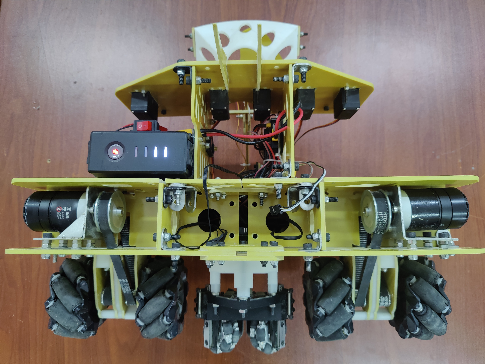

# **[Coaxial-MecanumWheel-BalanceRobot](https://github.com/saphyxia/Coaxial-MecanumWheel-BalanceRobot)**

Coaxial Mecanum wheel BalanceRobot

## 依赖工具及软硬件环境

工具：VSCode,Keil5

软件环境：Windows11

硬件环境：STM32F407

## 编译器及编译方式

Arm Compiler 6

C/C++编译

## 项目中断

存在问题：麦轮受力不均、底盘打滑，无法达到完成赛事需求的自动定位标准。

## 车体框架

